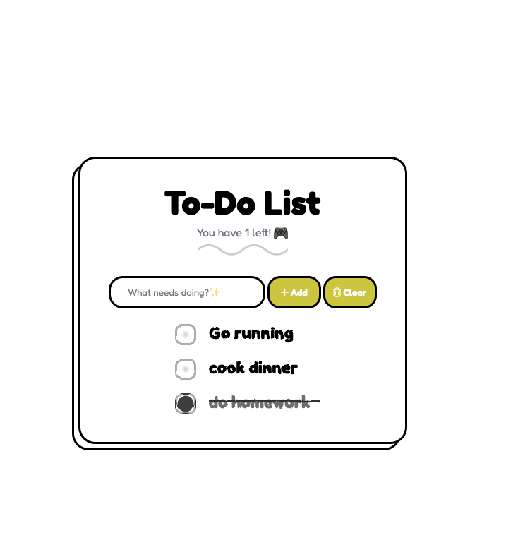

# ✅ Day 5 — To-Do List Web App (DOM Manipulation) 📋✨

Welcome to **Day 5** of my Full-Stack grind 😤💻  
Today’s project is a cute-but-deadly **To-Do List** built with **Vanilla JS + DOM manipulation** — add tasks, tick them off, and clear the list like a productivity demon 👹✅

---

## 🎥 What This App Does

✅ Add new tasks from an input field  
✅ Display tasks dynamically in the DOM  
✅ Tick tasks complete (with a ✨scribble✨ strike-through effect)  
✅ Clear the list with one button 🧹  
✅ Clean UI with a double-border “card” vibe (like a sticker) 🖼️

---

## 🧠 What I Practiced Today

- DOM selection (`querySelector`)
- Event handling (`submit`, `click`)
- Updating UI with `innerHTML`
- Storing tasks in an array and re-rendering
- Basic input validation (no empty/too short tasks)
- Styling: Flexbox, borders, hover effects, custom checkbox UI 🎨

---

## 🛠️ Tech Stack

- 🧱 HTML
- 🎨 CSS
- ⚡ JavaScript (Vanilla)
- 🧰 Font Awesome icons
- ✍🏽 “Hand-drawn” checkbox effect (Uiverse inspiration)

---

## 📂 Project Structure

```bash
Day-5-Todo-List/
├── index.html
├── app.css
├── app.js
└── assets/
    ├── favicon.png
    └── image.png
```

# 🚀 How To Run It

### Option 1: Open in Browser (simple)

1. Open index.html

2. Start typing tasks like a productive legend 😌


### Option 2: Live Server (recommended)

1. If you’re using VS Code:

2. Install Live Server

3. Right click index.html → Open with Live Server

3. Boom 💥 you’re running


### 🕹️ How To Use

1. Type a task into the input field

2. Click Add ➕

3. Tick tasks when done ✅

4. Click Clear 🗑️ to wipe the list clean

## ✨ Screenshot




- Rounded card layout

- Double border effect

- Checkbox scribble animation

- Clean “To-Do List” header


## 🧪 Notes + Bugs I Noticed

- Right now the list is stored in an array only while the page is open.
So if you refresh… poof 🫠 tasks vanish.

- Also I currently insert the SVG filter inside every task item — that works,
but it’s better practice to include it once in the HTML (future cleanup 😉).


## 🔮 Next Up (Glow-Up Ideas)

🔥 Save tasks using localStorage so the list survives refresh

🔥 Add a delete button per task 🗑️

🔥 Show task count properly (#count)

🔥 Add “Edit task” feature ✏️

🔥 Smooth animations for add/remove tasks 🎬

```

“Small app… big energy.”
— Me, after fighting CSS borders for 2 hours 🥲⚔️

```

### ✅ Day 5 complete. On to Day 6.